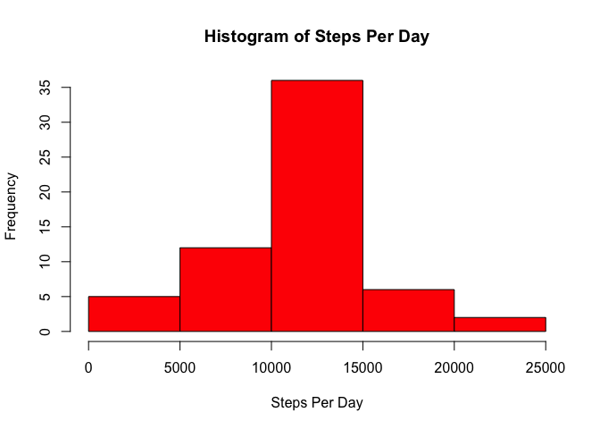

# Reproducible Research: Peer Assessment 1
Michael O'Connor  
December 7, 2014  

## Loading and preprocessing the data

First we'll load the `activity.csv` data.  I downloaded it to my
`~/Downloads` directory, so we'll load it from there and then convert
the `date` column to dates with `as.Date`.


```r
data <- read.csv("~/Downloads/activity.csv")
data$date <- as.Date(data$date)
```

## What is mean total number of steps taken per day?

We'd like to look at a histogram for steps per day, plus the mean and
median steps per day (ignoring `NA`s).  Since we're going to do this again later with a
different dataset, we'll first write a function to do this.


```r
analyzeStepsPerDay <- function(data) {
    stepsPerDay <- tapply(data$steps,data$date,sum,na.rm=TRUE)
    print(list(mean=mean(stepsPerDay),median=median(stepsPerDay)))
    hist(stepsPerDay,xlab="Steps Per Day",main="Histogram of Steps Per Day",col="red")
}
```

Now let's run this on the data set we just read in.

```r
analyzeStepsPerDay(data)
```

```
## $mean
## [1] 9354.23
## 
## $median
## [1] 10395
```

 

## What is the average daily activity pattern?

For the average daily activity pattern, we want to average the number
of steps over all days for each 5-minute interval, then graph a
timeseries of that.

The only complication is that for the plot we want now want to convert
the intervals (which are integers in the format `%H%M`) to regular
times.


```r
averagedSteps <- tapply(data$steps,data$interval,mean,na.rm=TRUE)

times <- strptime(sprintf("%04d",as.integer(dimnames(averagedSteps)[[1]])),format="%H%M")

plot(times,averagedSteps,type="l",xlab="",ylab="Steps",main="Steps Averaged Over 5-Minute Intervals",col="blue",lwd=3,tck=1)
```

 

The time interval with the greatest number of steps is given by:

```r
maxAveragedSteps <- max(averagedSteps)
format(times[averagedSteps == maxAveragedSteps], "%H:%M")
```

```
## [1] "08:35"
```
}

## Imputing missing values

Let's see how many rows have `NA`s in them.


```r
numCompleteRows <- sum(complete.cases(data))
numRowsWithNA <- nrow(data) - numCompleteRows
numRowsWithNA
```

```
## [1] 2304
```

Let's make sure the `date` and `interval` columns have no `NA`s:

```r
list(numNAsInDate=sum(is.na(data$date)),numNAsInInterval=sum(is.na(data$interval)))
```

```
## $numNAsInDate
## [1] 0
## 
## $numNAsInInterval
## [1] 0
```

That means that all the `NA`s are in the `steps` column.  Let's make a
new dataset with each `NA` filled in with the mean number of steps on
any given interval.


```r
meanPerInterval <- tapply(data$steps,data$interval,mean,na.rm=TRUE)

fillInNAs <- function(steps,interval) {
   if (!is.na(steps)) {
       steps
   } else {
       meanPerInterval[as.character(interval)]
   }
}

filledInNAs <- data.frame(date=data$date,interval=data$interval,steps=mapply(fillInNAs, data$steps, data$interval))
```

Let's confirm there are no `NA`s in our dataset.


```r
sum(is.na(filledInNAs$steps))
```

```
## [1] 0
```

How did the number of steps per day change?  We can find out by
running our `analyzeStepsPerDay` function on this new dataset.


```r
analyzeStepsPerDay(filledInNAs)
```

```
## $mean
## [1] 10766.19
## 
## $median
## [1] 10766.19
```

 

## Are there differences in activity patterns between weekdays and weekends?

We'd like now to split the data up based on whether or not it occurred
on a weekend.  Let's add a column with that data to the `filledInNAs`
data frame we constructed in the last section.


```r
isWeekendOrWeekday <- function (date) {
    weekday <- weekdays(date)
    if (weekday == "Monday" || weekday == "Tuesday" || weekday == "Wednesday" || weekday == "Thursday" || weekday == "Friday") {
        "weekday"
    } else {
        "weekend"
    }
}

filledInNAs <- cbind(filledInNAs, list(weekend=sapply(data$date,isWeekendOrWeekday)))
```

Finally, let's look plot steps by time conditioned on whether or not
it's a weekend.


```r
averagedSteps <- tapply(filledInNAs$steps,interaction(filledInNAs$interval,filledInNAs$weekend),mean)

weekendsAndTimes <- strsplit(dimnames(averagedSteps)[[1]],".",fixed=TRUE)

weekendOrNot <- sapply(weekendsAndTimes, function (x) x[2])
intervals <- sapply(weekendsAndTimes, function (x) as.integer(x[1]))

library(lattice)
xyplot(averagedSteps ~ intervals | weekendOrNot,type="l",layout=c(1,2))
```

 
